# Task 1: Process Mapping

## CI/CD Pipeline Process Map

```mermaid
flowchart LR
  Dev[Developer] -->|Push or pull request to main| GitHub[GitHub Repository]
  GitHub --> CI[GitHub Actions CI]
  CI --> Install[Install backend dependencies]
  Install --> Test[Run API tests]
  Test --> MQTTCheck[Verify MQTT broker health]
  MQTTCheck --> Metrics[Upload CI measurement artifacts]
  Metrics --> Build[Build backend and frontend Docker images]
  Build --> DockerHub[Push images to Docker Hub]
  DockerHub --> CD[GitHub Actions CD]
  CD --> Staging[Deploy staging]
  Staging --> Approval[Production approval gate]
  Approval --> Production[Production deployment]
  Production --> AWS[AWS EC2 Docker Compose deployment]
  AWS --> Health[Live health checks]
  Health -->|Pass| Live[BodaConnect live services]
  Health -->|Fail| Rollback[Rollback to previous commit]
  Live --> MQTT[MQTT broker]
  MQTT --> Backend[Backend API]
  Backend --> Frontend[Customer and driver app]
  Backend --> Prometheus[Prometheus metrics]
  Prometheus --> Grafana[Grafana dashboard]
```

## Actors

| Actor | Role |
| --- | --- |
| Developer | Writes code, commits changes, opens pull request or pushes to main. |
| GitHub Actions CI | Installs dependencies, starts MySQL/MQTT services, runs API tests, collects metrics. |
| Docker Hub | Stores versioned backend and frontend images. |
| GitHub Actions CD | Pulls approved build output and deploys to staging, production, and AWS EC2. |
| AWS EC2 | Hosts Docker Compose services: frontend, backend, MySQL, MQTT, Prometheus, Grafana. |
| Customer app | Passenger books ride and tracks driver status. |
| Driver app | Driver receives ride request, accepts, starts trip, completes trip. |
| MQTT broker | Sends ride request, status, and driver location messages. |
| Prometheus/Grafana | Collects and visualizes operational metrics. |

## Manual Steps and Delays

| Step | Manual or Delay Point | Risk |
| --- | --- | --- |
| Production approval gate | Requires release manager approval. | Deployment can wait even after CI passes. |
| GitHub secrets setup | Docker Hub and EC2 credentials are manually configured. | Missing or expired secrets block release. |
| EC2 local runtime files | Mosquitto database/log files can be changed by Docker at runtime. | Git pull can fail if runtime files are tracked or permission locked. |
| Visual evidence collection | Screenshots from GitHub Actions/Grafana are collected manually for reports. | Metrics can be missed if not saved as artifacts. |

## Bodaboda Business Workflow

```mermaid
flowchart LR
  Passenger[Passenger] --> Book[Book ride]
  Book --> RideRequest[Backend creates pending ride]
  RideRequest --> MQTTRequest[MQTT ride/request event]
  MQTTRequest --> Driver[Driver dashboard receives request]
  Driver --> Accept[Driver accepts]
  Accept --> Accepted[Ride status: accepted]
  Accepted --> Pickup[Driver travels to passenger pickup]
  Pickup --> Active[Ride status: active]
  Active --> Destination[Driver travels to destination]
  Destination --> Completed[Ride status: completed]
  Completed --> Review[Passenger rating and review]
  Review --> Metrics[Prometheus/Grafana metrics update]
```

