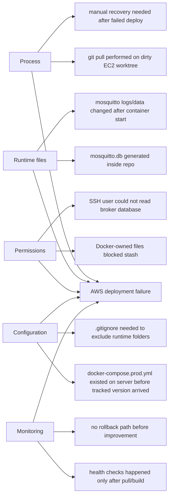

# Task 3: Process Analysis

## Selected Failure

During AWS EC2 deployment, GitHub Actions failed while running `git pull --ff-only origin main`.

Observed symptoms:

- `mosquitto/data/mosquitto.db`: permission denied during stash.
- `mosquitto/data/mosquitto.db`: local changes would be overwritten by merge.
- `docker-compose.prod.yml`: untracked file would be overwritten by merge.
- Deployment stopped before containers were rebuilt.

## 5 Whys Analysis

| Why | Question | Answer |
| --- | --- | --- |
| 1 | Why did deployment fail? | The EC2 repository could not pull the latest `main` branch. |
| 2 | Why could it not pull? | Local runtime files and an untracked production compose file conflicted with incoming repository files. |
| 3 | Why were runtime files inside the repository changing? | Mosquitto writes broker state and logs to mounted folders under the project directory. |
| 4 | Why could GitHub Actions not stash those files? | Docker-created runtime files had permissions that blocked the SSH deployment user. |
| 5 | Why was this not prevented earlier? | Runtime data was not fully separated from source-controlled files, and the deployment script did not unlock/clean runtime paths before pulling. |

## Root Cause

The deployment process mixed source-controlled application files with container-generated runtime files. This caused Git state conflicts and file permission problems during automated deployment.

## Fishbone Diagram

## Corrective Actions

| Issue | Improvement |
| --- | --- |
| Runtime file conflict | Ignore Mosquitto runtime folders and keep production compose in source control. |
| Permission denied during deploy | Stop MQTT container and change ownership of runtime folders before pull. |
| Failed deploy can leave app unhealthy | Add health-check-based rollback to previous commit. |
| Hard to measure failure patterns | Upload CI metrics and API test logs as GitHub Actions artifacts. |

## Preventive Actions

- Keep source code, configuration, and runtime data clearly separated.
- Store production deployment files in Git instead of creating them manually on EC2.
- Save CI/CD measurement artifacts for each run.
- Use Grafana/Prometheus and GitHub Actions logs to identify recurring bottlenecks.
